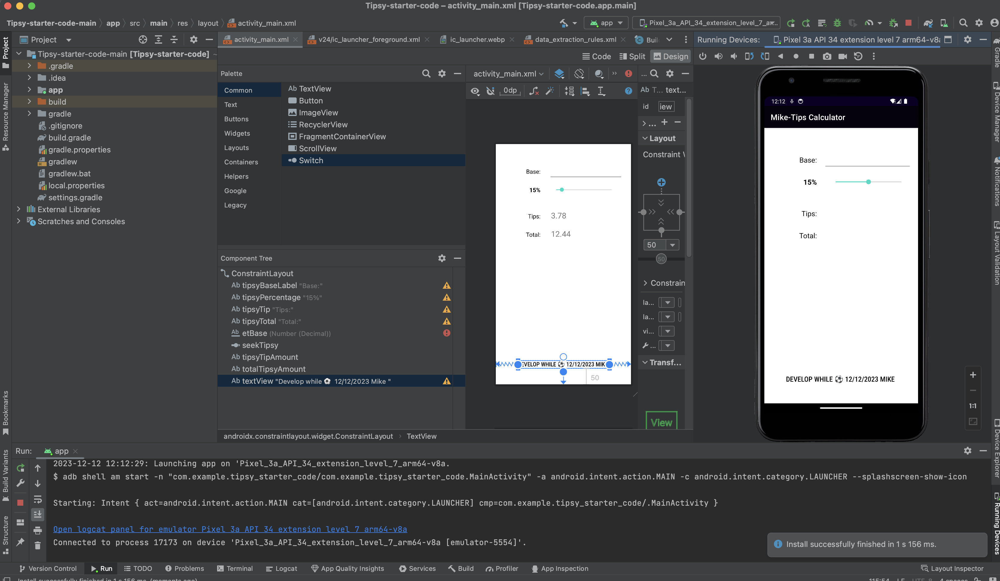

**Step 1**
```
let gladiators = [23,4,5,6,7,8,43,34,21,12];
function averagePower(gladiators){
    let totalPower = 0;
    for (let i =0 ; i < gladiators.length; ++i){
        totalPower  += gladiators[i];
    }
    return totalPower / gladiators.length;
}
console.log(averagePower(gladiators));

```
**Step 2,3,4**


